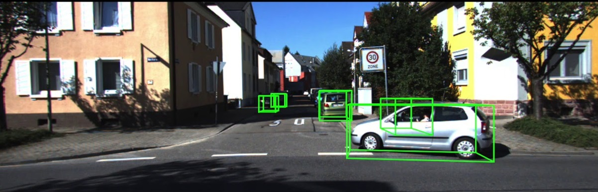

> __[Waymo Challenge: Object Detection / Tracking in RGB images*](https://arxiv.org/abs/2006.06500)__   
> Frank Gabel<sup>1</sup>, Jens Settelmeier<sup>2</sup>
>
> \* Work done during Corona lockdown
>
> <sup>1</sup> Heidelberg University
>
> <sup>2</sup> Stockholm University
>
>
>
> __Summary__ The waymo dataset is the largest and most diverse autonomous driving datasets ever released. It 
> consists of HD images of 5 cameras (front, front-left, front-right, left, right), LiDAR scans and associated 2D/3D bounding boxes.
> Data have temporal order (similar to videos). We tackle the problem of 2D object detection by deploying DeepSORT with an EfficientDet backbone.



This is a repo describing our approach to the [Waymo Challenge](https://waymo.com/open/challenges).
The challenges mandated to build a model detecting vehicles (anything with wheels, basically), cyclists and pedestrians.

As the data have a pretty significant time component, the general approach was to 
employ a tracking algorithm with an aggressive association metric, allowing to generalize to occlusions, shape changes etc.


We used a powerful tracking algorithm (DeepSORT) to keep track of objects. Our detection backbone was an [EfficientDet](https://github.com/google/automl/tree/master/efficientdet) with SOTA performance in real time, original paper link: https://arxiv.org/abs/1911.09070.

### Requirements
```
pip install -r requirements.txt

* pytorch==1.1.0 or 1.2.0  
* tqdm  
* opencv-python  
* scipy  
* sklearn
* matplotlib  
* pillow  
* tensorboardX 
```

__Dataset and Weights__  
* Download: [Waymo Open Dataset](https://waymo.com/open/)
* Pretrained weights:  [Google Drive](https://drive.google.com/drive/folders/1PA8yE5n7ZTliYXl6D6KdZKAz3JawyvtL)
```
Project
|--- EfficientDet-DeepSORT-Tracker
|          |--- main.py
|          |--- train
|                 |--- train_unsupervised.py
|                 |--- ...
|
|--- data
       |--- training
             |--- xxxxxxxxxxxx_0000.tfrecord
             |--- xxxxxxxxxxxx_0001.tfrecord
       |--- test
             |--- yyyyyyyyyyyy_0000.tfrecord
             |--- yyyyyyyyyyyy_0001.tfrecord
             |--- ...

Then, call --data_path='../data'
```

__Hardware__

This source code was mainly tested on an NVIDIA 2070 / 1080Ti.

__More examples__


__Run__
```
Using EfficientDet backbone
python run_waymo_deepsort_efficientdet.py --gpu $GPU_TO_USE --p_semi 1.0 --data_path='../data'

Semi-supervised
python run_waymo_deepsort_yolov4.py --gpu $GPU_TO_USE --p_semi 0.5 --data_path='../data'

```

__Train__

Training this model entails first training your backbone detector and then training DeepSORT.
```
Training EfficientDet backbone
python train.py --gpu $GPU_TO_USE --data_path='../data'

Training DeepSORT
python deep_sort/deep/train.py --gpu $GPU_TO_USE --data_path='../data'

```

## Benchmark

If you are not interested in training yourself, you can use our weights. Put them into the base directory and you are good to go.

| coefficient | pth_download | GPU Mem(MB) | FPS | Extreme FPS (Batchsize 32) | mAP | mAP 0.1:0.9|
| :-----: | :-----: | :------: | :------: | :------: | :-----: | :-----: |
| D7 | [efficientdet-weights.pth](https://drive.google.com/drive/folders/1PA8yE5n7ZTliYXl6D6KdZKAz3JawyvtL) | ~10000 | 5 | - | 52.2
| Yolo v4 | [yolov4.weights](https://drive.google.com/drive/folders/1PA8yE5n7ZTliYXl6D6KdZKAz3JawyvtL) | ~9000 | 7 | - | 54.4

## References

Appreciate the great work from the following repositories:
- [lukemelas/EfficientNet-PyTorch](https://github.com/lukemelas/EfficientNet-PyTorch)
- [signatrix/efficientdet](https://github.com/signatrix/efficientdet)
- [vacancy/Synchronized-BatchNorm-PyTorch](https://github.com/vacancy/Synchronized-BatchNorm-PyTorch)
- [DeepSORT](https://arxiv.org/abs/1703.07402)
